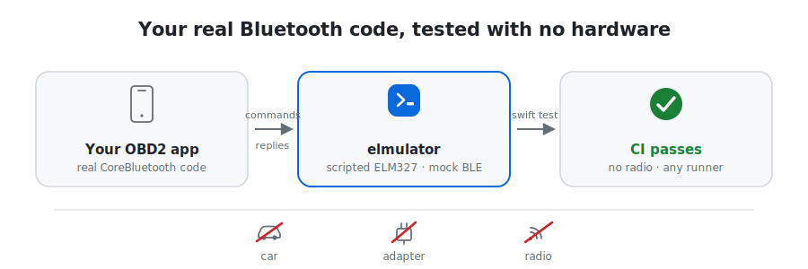

<div align="center">


<h3>A scriptable Bluetooth LE and TCP OBD2 (ELM327) adapter emulator and CI test harness</h3>

<p>Test your OBD2 app against a fake ELM327 over Bluetooth LE or TCP, without a car or a real adapter. MIT licensed.</p>

<p>
  <a href="https://github.com/qadanm/elmulator/actions/workflows/ci.yml"></a>
  <a href="https://pypi.org/project/elmulator/"></a>
  <a href="LICENSE"></a>
  
  
</p>

<br>



<p>
  <a href="docs/getting-started.md"><b>Getting started</b></a> &nbsp;·&nbsp;
  <a href="SPEC.md">Scenario spec</a> &nbsp;·&nbsp;
  <a href="docs/testing-obd2-apps-in-ci.md">iOS CI guide</a> &nbsp;·&nbsp;
  <a href="scenarios/">Scenarios</a>
</p>

</div>

---

Most OBD2 apps reach the car through a Bluetooth adapter, and that link is usually the hardest thing to test. The iOS Simulator has no Bluetooth at all, so the fallback is a phone, a real adapter, and a car sitting in the parking lot. elmulator gives you a fake adapter you can script, so the Bluetooth code can run in CI instead.

<p align="center">
  <picture>
    <source media="(prefers-color-scheme: dark)" srcset="assets/architecture-dark.svg">
    
  </picture>
</p>

What it does:

- A small macOS program advertises an ELM327-style GATT profile (Nordic UART by default), and your app connects to it over real Bluetooth. Nothing is mocked.
- The same engine also sits behind a `CentralStack` protocol. In unit tests you swap the real CoreBluetooth central for the fake one and run the whole connection flow with no radio.
- If your app already uses CoreBluetooth directly, there is a bridge to Nordic's [CoreBluetooth-Mock](https://github.com/NordicSemiconductor/IOS-CoreBluetooth-Mock). It turns a scenario into a mock BLE peripheral, so your existing `CBCentralManager` code runs against a scripted ELM327 under `swift test`. The [iOS CI guide](docs/testing-obd2-apps-in-ci.md) walks through it.
- One command serves a scenario over plain TCP, which covers the Simulator, Android, and anything else that can open a socket. There is a [GitHub Action](#run-it-in-github-actions) that does the same in one step.
- A scenario is just JSON. You write what the adapter replies, how it splits the reply into chunks, how long it waits, and when it stalls, drops the connection, or sends back garbage. Each file also records the scan result it should produce, so it works as a regression fixture.
- The Python and Swift servers are checked against each other byte for byte by a [conformance suite](conformance/), so a scenario behaves the same no matter which one you run.

The closest tool out there is [ELM327-emulator](https://github.com/Ircama/ELM327-emulator). It is good, but its Bluetooth support is RFCOMM serial (classic Bluetooth SPP) rather than the BLE/GATT that iOS adapters use, and its CC-BY-NC-SA license rules out commercial use. elmulator does BLE, has a testing story for iOS and CI, and is MIT. (Checked against its repo in 2026.)

## Quickstart

The example scenarios ship inside the package, so every snippet below loads one by name (`p0420_basic`) with no files on disk. Swap in a path to a `.scenario.json` when you want your own.

### In three lines, no app code

Drive a scripted adapter in-process, with no sockets and no radio. This is the fastest way to see what a reply looks like or to assert on it in a test.

```swift
import ElmulatorTestSupport

var adapter = try Conversation(bundled: "p0420_basic")
_ = adapter.send("ATZ")
#expect(adapter.send("03").contains("43 01 04 20"))   // reads P0420
```

```python
from elmulator import Conversation, load_bundled

adapter = Conversation(load_bundled("p0420_basic"))
adapter.send("ATZ")
assert "43 01 04 20" in adapter.send("03")             # reads P0420
```

### Over TCP, from any language

```bash
pip install elmulator
elmulator serve p0420_basic --port 35000   # a bundled name, or a path to your own scenario
# point your app's Wi-Fi/TCP transport at 127.0.0.1:35000
```

There is a built-in check that needs no app code:

```bash
elmulator self-test        # loopback smoke test: prints SELF-TEST OK
```

### The Bluetooth stack in a unit test (Swift)

```swift
import Elmulator
import ElmulatorBLE
import ElmulatorBLETestSupport

// A scripted adapter, running as an in-process BLE central. No Bluetooth radio.
let stack: any CentralStack = FakeCentral(scenario: try .bundled("p0420_basic"))

// Your production Bluetooth code targets this same `CentralStack` protocol (the
// real CoreBluetooth central implements it too), so drive it here and check
// the result against the scenario's expected_scan_summary. For the real
// central, use makeCoreBluetoothStack() instead.
```

The connection state machine that runs through power on, scan, connect, discover, subscribe, and ready lives in `ElmulatorBLE`. It is a plain value type, so it is easy to test on its own.

### A real Bluetooth peripheral (macOS)

```bash
swift run elmulator-ble --scenario scenarios/p0420_basic.scenario.json
# a real ELM327-style BLE peripheral is now advertising; connect a physical
# iPhone/app to it over CoreBluetooth
```

## Run it in GitHub Actions

The composite action installs elmulator, serves a scenario over TCP, and hands back the bound port. Point your app's TCP transport at it and run your tests.

```yaml
- uses: qadanm/elmulator@v0.3.1    # or @v0 to track the latest 0.x
  id: elm
  with:
    scenario: p0420_basic          # a bundled name, or a path in your repo
    version: "==0.3.1"             # optional; omit to install the latest

- run: swift test                  # or pytest, gradle, npm test, ...
  env:
    OBD_TCP_HOST: "127.0.0.1"
    OBD_TCP_PORT: ${{ steps.elm.outputs.port }}
```

## Test your iOS OBD2 app in CI

The Simulator cannot do Bluetooth, and there is [no supported way to mock `CBPeripheral`](https://developer.apple.com/forums/thread/764024), so the Bluetooth path tends to be the part of an OBD2 app that never gets a test. With CoreBluetooth-Mock, elmulator lets your real CoreBluetooth code run against a scripted ELM327 on an ordinary macOS runner:

```swift
let adapter = ElmulatorMockPeripheral(scenario: try .bundled("p0420_basic"))
adapter.simulate()                                  // scripted ELM327 as a mock BLE peripheral
let client = MyOBDClient(forceMock: true)           // your real CBCentralManager code
try await client.connect()
#expect(try await client.send("03").contains("43 01 04 20"))   // reads P0420, no radio
```

- Full walkthrough: [docs/testing-obd2-apps-in-ci.md](docs/testing-obd2-apps-in-ci.md)
- Sample client and its tests: [`Sources/ObdSampleClient`](Sources/ObdSampleClient/ELM327Client.swift) and [`Tests/ObdSampleClientTests`](Tests/ObdSampleClientTests/OBDCITests.swift)
- Building on [SwiftOBD2](https://github.com/kkonteh97/SwiftOBD2)? See [docs/testing-swiftobd2.md](docs/testing-swiftobd2.md)

## What's included

| Piece | Where | What it is |
|---|---|---|
| Scenario engine | `Elmulator` (Swift), `elmulator` (Python) | the request/reply engine: matching, echo, defaults, chunking, seeded jitter, stalls, disconnects |
| TCP server | `ElmulatorTCP` in-process, or the `elmulator-tcp` / `elmulator serve` CLI | serves a scenario over localhost TCP |
| Test client | `ElmulatorTestSupport` (`Conversation`, `Client`), and the Python `Conversation` / `Client` | drive the emulator in a few lines, in-process or over TCP |
| GitHub Action | [`action.yml`](action.yml) | `uses: qadanm/elmulator@v0.3.1` serves a scenario in CI and outputs the bound port |
| BLE test double | `ElmulatorBLETestSupport` (`FakeCentral`) | in-process fake central for CI, behind the `CentralStack` protocol |
| CoreBluetooth-Mock bridge | `ElmulatorCoreBluetoothMock` (`ElmulatorMockPeripheral`) | turns a scenario into a mock BLE peripheral so your real CoreBluetooth code runs in CI |
| BLE peripheral | `elmulator-ble` (macOS) | real CoreBluetooth peripheral advertising an ELM327 GATT profile |
| BLE transport kit | `ElmulatorBLE` | GATT profile, connection state machine, `CentralStack` protocol, real central |
| Scenario format | [`SPEC.md`](SPEC.md) and [`spec/`](spec/) | the `obd2.sim_scenario.v1` contract and its JSON Schema |
| Example library | [`scenarios/`](scenarios/) | seven scenarios, each doubling as a regression fixture, and each loadable by name |
| Conformance suite | [`conformance/`](conformance/) | byte-for-byte parity across implementations |

## Docs

- [Getting started](docs/getting-started.md): in-process, TCP, and a real BLE peripheral.
- [Test an iOS OBD2 app in CI](docs/testing-obd2-apps-in-ci.md): your real CoreBluetooth code, no radio.
- [Mock an ELM327 over Bluetooth](docs/mock-elm327-over-bluetooth.md): the three ways to fake the adapter.
- [elmulator vs ELM327-emulator](docs/elmulator-vs-elm327-emulator.md): what each one is for.
- [FAQ](docs/faq.md), plus the full [docs index](docs/).

## The scenario format

A scenario is a JSON file that describes a synthetic ELM327 conversation. For each command you give the request, the reply, and details like the delay, whether it echoes, the prompt behavior, and what happens afterward (a stall or a disconnect). There is also an `expected_scan_summary` block, which is the result a scan should end up with, so the file works as a test fixture too. See [SPEC.md](SPEC.md) for the full format and [scenarios/](scenarios/) for worked examples.

```jsonc
{
  "schema_version": "obd2.sim_scenario.v1",
  "scenario_id": "p0420_basic",
  "synthetic": true,
  "adapter_profile": "elm327_like_tcp",
  "defaults": { "at_response": "OK\r\r>", "obd_response": "NO DATA\r\r>" },
  "commands": [
    { "request": "ATZ", "response_chunks": ["ELM327 v1.5\r\r>"], "echo": true },
    { "request": "03",  "response_chunks": ["43 01 04 20\r\r>"] }
  ],
  "expected_scan_summary": { "stored_codes": ["P0420"], "mil_reported_on": true }
}
```

You can also build a scenario in code instead of writing JSON (`Scenario(id:commands:)` in Swift, `build_scenario` in Python), and diff a decoded scan against a scenario's `expected_scan_summary` with `mismatches(observed:)` in Swift or `summary_mismatches` in Python. elmulator emits bytes and never decodes OBD2 itself, so the summary is a convenience oracle for values your own app decoded.

## Cross-platform

The TCP server and the scenario format work with any language right now, since anything can open a socket. The in-process test double and the real BLE peripheral are Swift only for the moment. Plans for going wider, like a cross-platform BLE peripheral built on `bless` and ports of the engine, are in [docs/roadmap.md](docs/roadmap.md).

## Layout

```
Package.swift   SwiftPM package (root): engine, TCP, BLE kit, fake central,
Sources/        CoreBluetooth-Mock bridge, CLIs, and the ObdSampleClient example
Tests/
python/         pip package: TCP server and validator (pure stdlib)
scenarios/      example scenario library (the regression fixtures)
spec/           obd2.sim_scenario.v1 JSON Schema
conformance/    cross-implementation byte-for-byte parity suite
action.yml      GitHub Action that serves a scenario over TCP in CI
docs/           getting-started, iOS CI guide, SwiftOBD2 guide, roadmap
assets/         README demo (animated SVG and VHS tape)
SPEC.md         the scenario format specification
```

## Standards and provenance

Everything here is clean-room and sticks to standard OBD2 (SAE J1979 / ISO 15765-4). No GPL, AGPL, or non-commercial code was copied, and every scenario is written by hand, which is what lets the whole project be MIT.

## License

[MIT](LICENSE).
